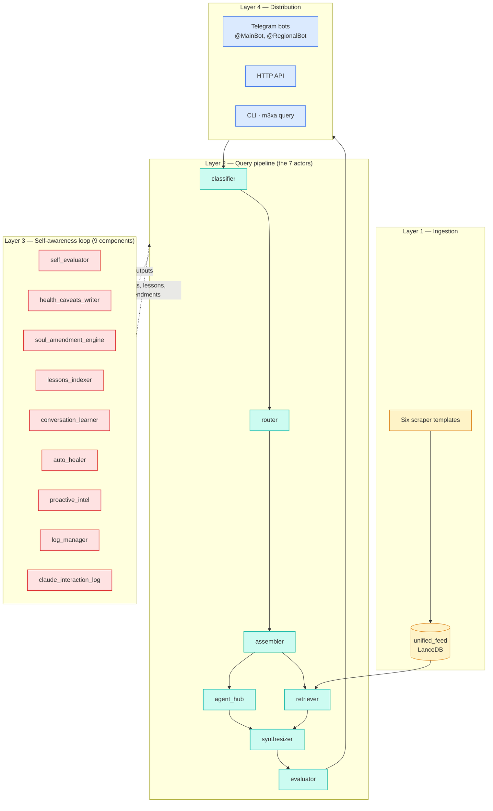

# Architecture

The full multi-server intelligence-agent pattern. m3xabr-core showed the expertise-composition slice; this file covers the whole picture.

## The four layers

## Layer 1 — Ingestion

Six scraper templates feed `unified_feed`. See [`m3xa_core/scrapers/README.md`](m3xa_core/scrapers/README.md) and [`concepts/source_tiering.md`](concepts/source_tiering.md).

Key design points:

- **One table.** `unified_feed` is the only retrieval table. Scrapers write to it; the retriever reads from it. No domain-specific vector stores.
- **`domain` column partitions.** `macro`, `geo`, `ai`, `region` — sibling corpora in the same physical table.
- **`has_vector` discipline.** Set to `1.0` only when `content_vector` is populated. Retriever filters on `has_vector = 1.0` — vectorless rows are invisible.
- **Stable ids.** Deterministic hash of source URL + chunk index. Re-running a scraper is a no-op.

## Layer 2 — Query pipeline

Same 7-actor shape as [m3xabr-core](https://github.com/prcodex/M3XABR_NEW), enriched with:

- **Agent hub** (Actor 3) fires data agents in parallel — markets, calendar, polymarket, boost agents. Each returns an `AgentContext` block the synthesizer concatenates.
- **Retriever** (Actor 4) runs vector ANN + entity-boost reranking. See [`concepts/institution_boost.md`](concepts/institution_boost.md).
- **Synthesizer** (Actor 5) reads from the House: kernel soul module + 1-3 routed expertises + retrieved docs + agent blocks + active health caveats + relevant lessons + relevant golden exchanges.
- **Evaluator** (Actor 7) gates the response on the editorial rubric; low score triggers one regen.

## Layer 3 — Self-awareness loop

Nine runtime components. Walk through them in [`concepts/self_awareness_loop.md`](concepts/self_awareness_loop.md). Each:

- Watches one signal (per-response audit, follow-up rates, health pings, …)
- Writes one artifact (JSONL log, markdown caveat, proposal file, SQLite row)
- Has a clear blast radius (Memory writes are auto; Soul writes require `#approve`; Body writes are autogen-only)

## Layer 4 — Distribution

Outside the repo's hard scope, but documented as patterns. The reader's private fork wires these up.

- **Telegram bots** — `@MainBot` and `@RegionalBot` (aliases). Each has its own user filter, command set, and soul module loaded.
- **HTTP API** — FastAPI service exposing the pipeline as `/api/rag`.
- **CLI** — `m3xa query "..."` runs one query interactively. Used for development and demos.

## Server topology (anonymized)

The live system this descends from runs on three servers. The repo's CI doesn't deploy anywhere; servers are documented as a pattern.

| Server alias | Role |
|---|---|
| `RagHost` | 7-actor pipeline + 9 self-awareness components |
| `ScraperHub` | Most scrapers + the market dashboard + intel summary |
| `Gateway` | Wiki, MCP server, the public-facing HTTP API |

Cron schedules live in [`config/cron/cron_patterns.yaml`](config/cron/cron_patterns.yaml).

## What's not in this repo

- Real source names (banks, expert analysts, podcasts, wires) — see [`docs/source_naming.md`](docs/source_naming.md)
- Real auth — API keys, cookies, basic-auth credentials
- Real Telegram tokens or user IDs
- The proprietary soul prompts that encode the live system's editorial voice
- The actual entity registry contents

These belong in the reader's private fork. The pattern is here.
