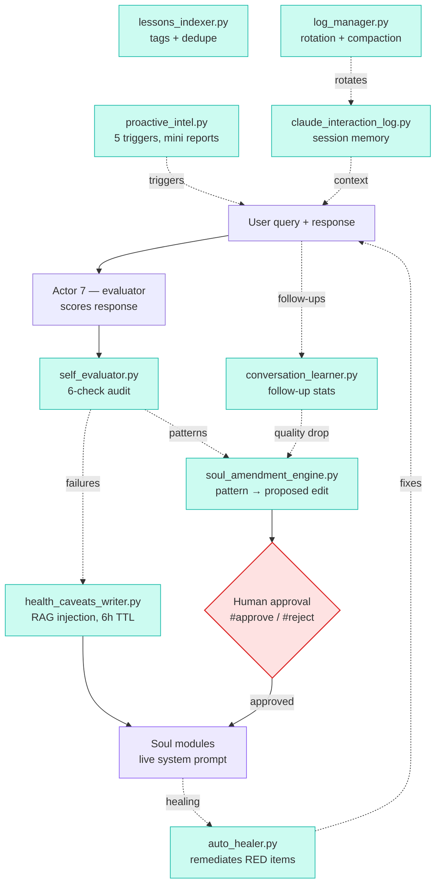

# m3xa-core

> A didactic reference for building a self-aware intelligence agent — the **House** pattern. Scrapers feed a vector store, a 7-actor pipeline composes expertise per query, and **nine runtime loops** watch the system from the inside and amend it.

`m3xa-core` is the **broader sibling** of [`m3xabr-core`](https://github.com/prcodex/M3XABR_NEW). m3xabr-core showed *just* the expertise-composition slice; this repo shows the **whole house**: how raw web content turns into vectors, how queries get answered, and — the interesting part — how the agent watches itself, learns from corrections, proposes its own prompt edits, and surfaces drift before it becomes a bug.

**Status:** Public, MIT, didactic. Everything operational is anonymized: real source names (banks, analysts, podcasts) are replaced with `Bank1`, `Expert1`, `Podcast1` and explained in [`docs/source_naming.md`](docs/source_naming.md). API keys and credentials are never committed. The point is the *pattern*, not the production system.

## What this is, exactly

A working Python package that implements the House pattern end-to-end against a vector corpus you provide. Specifically:

1. **A 7-actor query pipeline** — classifier → router → assembler → agent hub → retriever → synthesizer → evaluator (extended from m3xabr-core)
2. **Scraper templates** — six pattern-templates (Substack, RSS, Twitter, YouTube, Email, generic Web) that show *how* to feed `unified_feed`, not the live scrapers themselves
3. **Nine self-awareness components** — health caveats, soul amendments, lessons indexer, conversation learner, self-evaluator, auto-healer, proactive intel, log manager, claude interaction log. Each one is a small module with a clear contract.
4. **The House metaphor as code** — `m3xa_core/house/` has `soul`, `body`, `mind`, `memory` as concrete modules a reader can follow
5. **A self-knowledge layer** — `BODY.md` autogenerates from the codebase, CI fails on drift. Same pattern as m3xabr-core, scaled up.

If you want to learn just expertise composition, read [`m3xabr-core`](https://github.com/prcodex/M3XABR_NEW). If you want to learn how a complete intelligence agent stays coherent over time, read this.

## The House loop

This is the bird's-eye view. The arrows are real — code paths exist for each one. Every node is clickable.

```mermaid
flowchart LR
    subgraph world["The world"]
        SRC1[Bank1 research<br/>via Substack]
        SRC2[Expert1, Expert2<br/>via Twitter / Substack]
        SRC3[Wire1 / Wire2<br/>via RSS]
        SRC4[Podcast1..5<br/>via YouTube + audio]
    end

    SCR[Scrapers<br/>6 templates]
    UF[(unified_feed<br/>LanceDB)]
    PIPE[7-actor pipeline<br/>classifier → … → evaluator]
    BOT[Distribution<br/>Telegram / API / CLI]
    USER[User]
    SA[Self-awareness loop<br/>9 runtime components]
    BODY[BODY.md<br/>self-knowledge spec]

    SRC1 --> SCR
    SRC2 --> SCR
    SRC3 --> SCR
    SRC4 --> SCR
    SCR --> UF
    USER -- query --> PIPE
    UF -- retrieve --> PIPE
    PIPE -- response --> BOT
    BOT --> USER
    USER -. feedback / corrections .-> SA
    PIPE -. evaluator output .-> SA
    SCR -. health pings .-> SA
    SA -. proposed amendments .-> PIPE
    SA -. drift signals .-> BODY
    BODY -. read-before-edit .-> SCR

    classDef src fill:#fef3c7,stroke:#d97706;
    classDef pipe fill:#ccfbf1,stroke:#14b8a6,stroke-width:1.5px;
    classDef store fill:#ede9fe,stroke:#8b5cf6;
    classDef sa fill:#fee2e2,stroke:#dc2626,stroke-width:1.5px;
    classDef spec fill:#dbeafe,stroke:#2563eb;
    class SRC1,SRC2,SRC3,SRC4 src;
    class SCR,PIPE,BOT pipe;
    class UF store;
    class SA sa;
    class BODY spec;

    click SCR "https://github.com/prcodex/m3xa-core/blob/HEAD/m3xa_core/scrapers/" "Scraper templates" _self
    click UF "https://github.com/prcodex/m3xa-core/blob/HEAD/docs/SCHEMA.md" "unified_feed schema" _self
    click PIPE "https://github.com/prcodex/m3xa-core/blob/HEAD/m3xa_core/pipeline.py" "Pipeline orchestrator" _self
    click BOT "https://github.com/prcodex/m3xa-core/blob/HEAD/m3xa_core/cli.py" "Entry points" _self
    click SA "https://github.com/prcodex/m3xa-core/blob/HEAD/concepts/self_awareness_loop.md" "Self-awareness loop concept" _self
    click BODY "https://github.com/prcodex/m3xa-core/blob/HEAD/BODY.md" "BODY.md self-knowledge spec" _self
    click SRC1 "https://github.com/prcodex/m3xa-core/blob/HEAD/docs/source_naming.md" "How sources are anonymized" _self
    click SRC2 "https://github.com/prcodex/m3xa-core/blob/HEAD/docs/source_naming.md" "How sources are anonymized" _self
    click SRC3 "https://github.com/prcodex/m3xa-core/blob/HEAD/docs/source_naming.md" "How sources are anonymized" _self
    click SRC4 "https://github.com/prcodex/m3xa-core/blob/HEAD/docs/source_naming.md" "How sources are anonymized" _self
```



## The self-awareness loop

The piece that doesn't exist in m3xabr-core. Every response, every health check, every user correction feeds back into the system. Nine small components — each is a separate module under [`m3xa_core/self_awareness/`](m3xa_core/self_awareness/).



Detailed walk-through: [`concepts/self_awareness_loop.md`](concepts/self_awareness_loop.md).

## How to read this repo

If you're new to the pattern, read in this order:

1. [`concepts/the_house.md`](concepts/the_house.md) — the metaphor (Soul / Body / Mind / Memory / Travel) and why it exists
2. [`concepts/self_awareness_loop.md`](concepts/self_awareness_loop.md) — the nine loops, end to end
3. [`ARCHITECTURE.md`](ARCHITECTURE.md) — the 7-actor pipeline (extends m3xabr-core)
4. [`concepts/source_tiering.md`](concepts/source_tiering.md) — Wire > Expert > Institutional + the both-sides rule
5. [`concepts/intel_summary.md`](concepts/intel_summary.md) — the 8×/day briefing with actor monitor
6. [`concepts/golden_exchange.md`](concepts/golden_exchange.md) — turning labeled chats into retrieval boosts
7. [`m3xa_core/scrapers/README.md`](m3xa_core/scrapers/README.md) — six scraper templates
8. [`BODY.md`](BODY.md) — the live infrastructure map (autogenerated)

## Quickstart

```bash
git clone https://github.com/prcodex/m3xa-core.git
cd m3xa-core
pip install -e ".[markets,dev]"

# Run the smoke test pipeline against the example corpus
m3xa query "What does Expert1 think about Country1 inflation?" --lancedb ./examples/sample_corpus

# List the loaded expertises
m3xa expertises

# Inspect the self-awareness components
m3xa healthcheck
```

You'll need an `ANTHROPIC_API_KEY` and a `VOYAGE_API_KEY` (free tier covers the smoke test).

## What's anonymized, and why

Real source names — banks, expert analysts, podcasts, wire services — are scrubbed throughout. Readers learn the *taxonomy* (tier-1 bulge-bracket, regional commercial, independent macroanalyst, state-aligned media) without learning Pedro's actual source list, which would compromise the live system this pattern descends from.

The translation key is in [`docs/source_naming.md`](docs/source_naming.md). The blocklist of forbidden tokens is hashed and committed at [`.anonymization-blocklist.sha256`](.anonymization-blocklist.sha256); CI fails any PR that introduces a real name. See [`concepts/source_tiering.md`](concepts/source_tiering.md) for the full rationale.

## Self-knowledge layer

Like m3xabr-core, this repo maintains its own infrastructure map ([`BODY.md`](BODY.md)) auto-regenerated from the codebase, with three-layer enforcement: pre-commit hook + CI workflow + pytest mirror. The full convention is in [`AGENTS.md`](AGENTS.md). When a future coding agent (Claude Code, Cursor, Copilot) opens this repo, BODY.md is the file it reads first.

## What this isn't

- **Not a deployable production system.** It's a library. You bring your corpus, your scrapers (using the templates as starting points), your Telegram bot or web UI.
- **Not a complete clone of any real intelligence service.** It's the *pattern* — the architecture, the loops, the trade-offs. The proprietary source list, soul prompts, and editorial voice of the live system this descends from are not here.
- **Not a place to file bugs against a buy-side product.** The bank/expert names you might recognize from the original system are deliberately scrubbed.

## License

MIT. See [LICENSE](LICENSE).

## Related repos

- [`m3xabr-core`](https://github.com/prcodex/M3XABR_NEW) — the expertise-composition slice (smaller, narrower).
- [`m3xa-wiki`](https://github.com/prcodex/m3xa-wiki) (private) — Karpathy-style narrative wiki for adjacent topics.
