# The self-awareness loop

> An agent that doesn't watch itself becomes brittle. Not in a dramatic way — it just stops improving. The corrections you tell it never land in the system, the failure patterns repeat across queries, and the drift accumulates faster than the human can catch.

This is the piece m3xabr-core skips. Nine components run alongside the query pipeline; each watches one signal and writes one artifact. None of them is clever on its own. The interesting behavior is in how they compose.

## The nine

```mermaid
flowchart LR
    Q[User query<br/>+ pipeline response]

    SE[**1. self_evaluator**<br/>6-check audit per response]
    HC[**2. health_caveats_writer**<br/>RAG injection · 6h TTL]
    SA[**3. soul_amendment_engine**<br/>pattern → proposed soul edit]
    LI[**4. lessons_indexer**<br/>LESSONS.md → tagged JSON]
    CL[**5. conversation_learner**<br/>follow-up + intent stats]
    AH[**6. auto_healer**<br/>remediates RED items]
    PI[**7. proactive_intel**<br/>5 triggers · 3h mini reports]
    LM[**8. log_manager**<br/>rotation + compaction]
    CIL[**9. claude_interaction_log**<br/>persistent session memory]

    Q --> SE
    SE -. failures .-> HC
    SE -. patterns .-> SA
    Q -. follow-ups .-> CL
    CL -. quality drop .-> SA
    HC -. RAG ctx .-> Q
    SA -. waiting for #approve .-> HUMAN[Human approval]
    HUMAN -- approved --> SOUL[Soul modules]
    SOUL -. healing .-> AH
    AH -. fixes .-> SE
    PI -. triggers .-> Q
    LM -. rotates .-> CIL
    CIL -. context .-> Q

    classDef sa fill:#fee2e2,stroke:#dc2626,stroke-width:1.5px;
    classDef ctrl fill:#fef3c7,stroke:#d97706;
    classDef live fill:#ccfbf1,stroke:#14b8a6;
    class SE,HC,SA,LI,CL,AH,PI,LM,CIL sa;
    class HUMAN ctrl;
    class Q,SOUL live;

    click SE "https://github.com/prcodex/m3xa-core/blob/HEAD/m3xa_core/self_awareness/self_evaluator.py" _self
    click HC "https://github.com/prcodex/m3xa-core/blob/HEAD/m3xa_core/self_awareness/health_caveats_writer.py" _self
    click SA "https://github.com/prcodex/m3xa-core/blob/HEAD/m3xa_core/self_awareness/soul_amendment_engine.py" _self
    click LI "https://github.com/prcodex/m3xa-core/blob/HEAD/m3xa_core/self_awareness/lessons_indexer.py" _self
    click CL "https://github.com/prcodex/m3xa-core/blob/HEAD/m3xa_core/self_awareness/conversation_learner.py" _self
    click AH "https://github.com/prcodex/m3xa-core/blob/HEAD/m3xa_core/self_awareness/auto_healer.py" _self
    click PI "https://github.com/prcodex/m3xa-core/blob/HEAD/m3xa_core/self_awareness/proactive_intel.py" _self
    click LM "https://github.com/prcodex/m3xa-core/blob/HEAD/m3xa_core/self_awareness/log_manager.py" _self
    click CIL "https://github.com/prcodex/m3xa-core/blob/HEAD/m3xa_core/self_awareness/claude_interaction_log.py" _self
```

### 1. `self_evaluator` — every response gets audited

Runs after the synthesizer, alongside the main evaluator (Actor 7). Where Actor 7 scores user-facing quality, the self-evaluator runs six structural checks:

1. **Source attribution** — does every analyst-style claim point at a retrieved doc?
2. **Recency violation** — is the response citing data that's older than the user's implicit time window?
3. **Refusal misfire** — did the model refuse something it shouldn't have, or fail to refuse something it should have?
4. **Format drift** — is the output schema matching what the soul module promised?
5. **Entity hallucination** — does any named entity in the response actually appear in retrieved docs?
6. **Confidence calibration** — does the response hedge proportionally to retrieval coverage?

Writes a JSON line per response into a rotating log. Failures fan out: structural ones go to `health_caveats_writer`, recurring patterns go to `soul_amendment_engine`.

### 2. `health_caveats_writer` — temporary "the X is broken" warnings

When a structural failure is detected (a scraper hasn't run in 24h, a source is consistently empty, a tier-1 source went silent), the health_caveats_writer creates a short markdown file with a 6-hour TTL. Until it expires, the retriever injects that caveat into the synthesizer's context.

Example caveat (anonymized):

> ⚠️ `Wire2` has not posted since 14:00 UTC. Coverage of region B may be stale. When answering about region B, note that the most recent wire data is from earlier today.

Why 6 hours? Long enough that the agent stays honest about the gap; short enough that yesterday's broken scraper doesn't poison today's response.

### 3. `soul_amendment_engine` — patterns become proposed edits

Reads `self_evaluator`'s output over a moving window (last N responses). When a failure pattern repeats — same expertise, same kind of structural error, ≥3 occurrences — it drafts a proposed amendment to the soul module that owns that expertise.

The amendment is **never auto-applied**. It lands in a `proposed_amendments/` directory with a one-sentence diagnosis, the suggested patch, and the responses that triggered it. A human types `#approve` or `#reject` (or just edits the soul module directly and the engine's proposal becomes moot).

This is the loop's most important property: **the agent's identity changes only with human consent.** Everything else can run autonomously.

### 4. `lessons_indexer` — making LESSONS.md searchable

LESSONS.md is markdown — pretty for humans, useless for runtime context. The `lessons_indexer` parses it into a tagged JSON index keyed on the domains each lesson applies to.

At query time, the synthesizer can pull a relevant lesson into context — for example, when the user asks about a topic the project has *known failure modes* in, the corresponding lesson gets prepended ("The system has previously over-confidently answered about X without source. Be explicit about evidence.").

### 5. `conversation_learner` — what does the user actually want?

Watches multi-turn sessions. When the user asks a follow-up, it's a signal that the first answer was incomplete. The `conversation_learner` aggregates:

- **Follow-up rate per expertise** — which expertises produce more "but what about…" responses?
- **Source quality per follow-up** — when the user follows up, was the original response light on the relevant tier?
- **Intent shifts** — does the user's intent change between turns in predictable ways (e.g., always asking for the macro angle after a political answer)?

Aggregates feed into the `soul_amendment_engine` when a pattern is loud enough.

### 6. `auto_healer` — remediates without asking

For RED-flag items that have a known fix, the auto-healer just does it. Examples:

- A scraper crashed → restart it
- A LanceDB index lookup returned zero rows where the most recent ingest landed → call `.optimize()` on the table
- A health check shows a stale process → `pkill` and let systemd restart
- The FeedCache is older than its block-on-stale window → invalidate

Auto-healer never changes the **Soul** or the **Mind**. It only touches Body-adjacent runtime state. Its blast radius is bounded by what it can do without asking.

### 7. `proactive_intel` — five triggers, mini reports

The only component that *initiates* output without a user query. Five triggers:

- **Burst detection** — a single entity is being mentioned across many sources in a short window
- **Counter-narrative** — the state-aligned media has flipped tone on a topic the analytical sources are still on the previous narrative for
- **Calendar threshold** — a known scheduled event is within N hours
- **Polymarket move** — a tracked prediction market has moved >X%
- **Source silence** — a tier-1 source on a topic has gone unusually quiet

Each trigger fires a *mini report* — short, focused, attributed — to the distribution layer. The user sees these as proactive pings rather than answers to questions.

### 8. `log_manager` — rotation + compaction + archival

Boring but essential. Without it, the JSONL logs the other components write grow until they crowd out everything else on disk. The `log_manager` runs daily:

- Rotate logs older than 7 days into `.gz`
- Compact the SQLite databases (memory.db, golden_exchanges.db, brainstorm_sessions.db)
- Archive logs older than 90 days to cold storage (S3-shaped, but the repo only ships the local-disk archive path)

Listing it as "self-awareness" is a stretch — but it's a runtime component that watches the system from the inside, and without it the rest of the loop drowns.

### 9. `claude_interaction_log` — persistent session memory

When a coding-agent session (Claude Code or similar) talks to the running system through a side channel (an MCP tool, a slash command), the interaction log persists the relevant context across sessions. Why this matters: the next agent that opens the repo can pick up the previous agent's threads.

Two reads:

- **At the start of a session** — what was the previous agent working on?
- **At query time** — the synthesizer can pull recent interaction-log context if the user's query is about ongoing work

## The properties this loop has

Three claims worth stating clearly:

**1. No component changes the Soul without explicit approval.**
This is the most important rule. The `soul_amendment_engine` *proposes*; a human *approves*. Without this gate, the agent's identity drifts at the speed of the noisiest signal, and that always ends badly.

**2. Each component has one write path.**
The `self_evaluator` writes audit JSONL. The `health_caveats_writer` writes markdown caveats. The `soul_amendment_engine` writes proposal files. They never cross-write into each other's storage. This is how you keep the loop debuggable — every artifact has exactly one author.

**3. Components can be turned off independently.**
The pipeline runs fine with zero self-awareness components active. Each one is an opt-in module. You can enable `self_evaluator` without enabling `soul_amendment_engine`; you can run `auto_healer` without the others. **The loop is a *menu*, not a *framework*.**

## Anti-patterns to avoid

- **Auto-writing the Soul.** Don't. Even if you trust the amendment engine, the day it's wrong, you've lost your identity layer.
- **Combining two components into one because they "fit together."** They don't. Keep them small and single-purpose. The `health_caveats_writer` and the `auto_healer` both react to scraper outages, but they react *differently* — one informs the user, the other tries to fix the scraper. Combining them turns into a tangle.
- **Letting the audit log run the show.** The `self_evaluator` is the loudest component (a JSON line per response). It's tempting to drive every other component off its output. Don't. The conversation_learner needs *session-level* signal, not per-response signal. The proactive_intel needs *cross-session* signal. Pick the right input scope per component.

## A query trace, end to end

User asks: *"What's `Expert1`'s view on `CountryA` inflation given fiscal pressure?"*

1. **Classifier** (Haiku) — tags as `{topics: [monetary, fiscal], entities: [Expert1, CountryA]}`
2. **Router** (Haiku) — picks `monetary_analysis` + `fiscal_analysis` expertises
3. **Assembler** — concatenates the kernel + scope filter + the two expertises
4. **Agent hub** — fires the markets agent (CountryA FX + rates context)
5. **Retriever** — searches `unified_feed` filtered to `Expert1` mentions + `CountryA` macro tag. **Memory injection**: `health_caveats_writer` finds an active caveat — "Wire2 has been silent on CountryA fiscal for 4h" — and prepends it. `lessons_indexer` finds a relevant lesson — "When citing Expert1 on inflation, always check that the cited piece is post-CountryA's most recent print" — and prepends it.
6. **Synthesizer** (Sonnet) — answers in Pedro's analytical voice using the assembled prompt + retrieved docs + the caveat + the lesson
7. **Evaluator** (Actor 7) — scores user-facing quality on the editorial rubric

In parallel:

- **`self_evaluator`** runs its 6 checks. If the response cited a piece older than the user's implicit window, it logs a recency violation. If three such violations land in the last N responses for `monetary_analysis`, the `soul_amendment_engine` drafts a proposed amendment ("monetary_analysis.md should specify: when citing Expert1, prefer pieces from the last 30 days unless explicitly historical").
- **`conversation_learner`** records the turn. If the user follows up with "...but what about the central bank's reaction function?", it logs a follow-up event tagged to `monetary_analysis`.
- If the user later types `#gold` to mark this exchange as high-quality, the `golden_exchange_learner` extracts a labeled learning ("Expert1 on CountryA inflation: fiscal anchor matters more than headline CPI"). Next time someone asks a related question, that learning is in the retrieval context.

The whole loop is **observable**. Every step writes one artifact. You can read the artifacts after the fact and understand exactly why the system responded the way it did.

## See also

- [`the_house.md`](the_house.md) — the rooms the loop reads from and writes to
- [`soul_amendment_engine.md`](soul_amendment_engine.md) — the deepest dive into the most important component
- [`golden_exchange.md`](golden_exchange.md) — how labeled exchanges feed retrieval
- [`m3xa_core/self_awareness/`](../m3xa_core/self_awareness/) — the nine components as code
