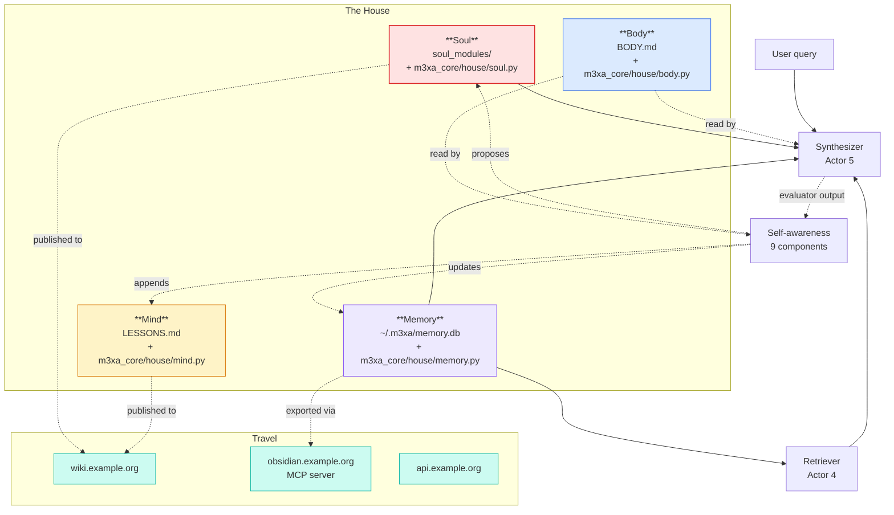

# The House

> The agent is a *house* you build over time, not a *prompt* you tune. A house has rooms with different functions. You don't paint the kitchen and the bedroom the same color.

The codebase is organized around five rooms. Each room has a clear role, a clear write path, and a clear read path. Mixing them up is how monolithic agents get unmaintainable.

## The five rooms

| Room | What it holds | Read by | Written by |
|---|---|---|---|
| **Soul** | Identity, voice, analytical lens, refusal rules | Synthesizer (Actor 5) | Humans + the soul amendment engine (with human approval) |
| **Body** | The infrastructure spec — what runs where, what depends on what | Any coding tool reading the repo | The autogen pipeline + humans (for invariants) |
| **Mind** | Lessons learned — structural mistakes the project has burned hours on | Coding tools before they refactor; future Actor 8 | Humans + agents after a non-obvious fix |
| **Memory** | Past exchanges — golden labeled chats, conversation history, session state | Retriever (Actor 4) + synthesizer (Actor 5) | The session loop + golden_exchange_learner |
| **Travel** | Things outside the house — wiki, MCP servers, external endpoints | Anything that needs to leave the local repo | Humans + deployment automation |

The line that holds the metaphor together: **a house has rooms, not a single open-plan space.** A prompt that mixes identity, lessons, current state, and external context produces an agent that drifts. Separating them produces an agent that can be edited surgically.

## Why this is different from "just use modules"

You can build any agent as five Python modules. What the House gets you on top of that:

1. **Different writers per room.** The Soul has a *human approval gate* — even when the soul amendment engine proposes an edit, a human types `#approve` before it lands. The Body is autogenerated from the code. The Mind is appended-to by humans and agents after fixes. The Memory is written by the runtime. **Knowing who writes what is half the design.**

2. **Different decay rates per room.** The Body needs to be in lockstep with the code (CI enforces this). The Mind grows forever (append-only). The Memory has TTLs (health caveats expire in 6 hours; conversation history in 30 minutes; golden exchanges decay over 30 days). The Soul changes slowly and only with approval. Conflating decay rates in one big prompt blows everything up at the half-life of the noisiest room.

3. **Different blast radius per room.** A bad Memory write affects one session. A bad Mind entry affects future refactors. A bad Soul edit affects every response. **The blast radius determines the approval level.** Memory is auto-write; Mind is auto-append with human review at commit time; Soul is human-approved per edit.

## The map, with code locations

## The Soul, in detail

Lives at [`soul_modules/`](../soul_modules/) and [`m3xa_core/house/soul.py`](../m3xa_core/house/soul.py).

A *soul module* is a markdown file with YAML frontmatter. The frontmatter declares what triggers the module to load; the body is the analytical lens that will be concatenated into the synthesizer's system prompt. This is the same shape as the `expertises/` files in m3xabr-core — the Soul **is** the expertise pool, plus a few modules that always load (identity, output rules, refusal rules).

Two read paths:

1. **Per-query** — the router picks 1-3 modules based on the query topic. The assembler concatenates them into the synthesizer's system prompt.
2. **Always-on kernel** — a tiny "identity" module that loads every time, telling the LLM *who* it is (analytical voice, language, output format conventions).

One write path: humans, or the `soul_amendment_engine` *with human approval via `#approve`/`#reject`*. Direct auto-writes to the soul are forbidden. The blast radius is too high.

## The Body, in detail

Lives at [`BODY.md`](../BODY.md) and [`m3xa_core/house/body.py`](../m3xa_core/house/body.py).

`BODY.md` is the **live infrastructure spec** — what actors exist, what scrapers exist, what self-awareness components exist, what env vars are read, what the public API surface is. It's autogenerated from the codebase by `tools/regenerate_body.py`; CI fails if it drifts.

Why a single file and not a directory? Because the readers (Claude Code, Cursor, GitHub Copilot, future Actor 8) all expect a single entry point. A directory of body docs becomes a fan-out problem — five different "where do I start" trees for five different tools. One file, with autogen sections clearly marked, beats a tree of partial truths.

Why autogenerated and not hand-written? Because hand-written infrastructure docs decay. Always. The day someone refactors an actor signature without remembering to update the doc, the doc lies. CI enforcement closes that loop.

## The Mind, in detail

Lives at [`LESSONS.md`](../LESSONS.md) and [`m3xa_core/house/mind.py`](../m3xa_core/house/mind.py).

The Mind is append-only. Every entry has a date, a one-sentence lesson, the reason it matters (often a past incident), and a how-to-apply note. New entries get added when a fix surfaces a *structural* mistake — not for ordinary bugs.

Two read paths:

1. **Before refactors** — coding agents read LESSONS.md before making non-trivial changes. The lessons are what BODY.md *can't* tell you: not what the system looks like, but what it tried to look like and failed.
2. **Indexed for the synthesizer** — `lessons_indexer.py` (a self-awareness component) parses LESSONS.md into a tagged JSON index. The synthesizer can pull a relevant lesson into context when the user's query touches a domain with a known failure mode.

One write path: humans or AI coding tools (working alongside humans), after a fix. The format is intentionally heavy — the lesson must be one sentence; the why-it-matters must reference a real incident — so the bar to add is high. Otherwise the file fills with noise.

## The Memory, in detail

Lives at [`m3xa_core/house/memory.py`](../m3xa_core/house/memory.py). Backed by a small SQLite database (`~/.m3xa/memory.db` by default).

Holds:

- **Conversation history** — per session, with TTL ~30 minutes
- **Golden exchanges** — labeled high-quality exchanges that get injected into retrieval context for relevant future queries
- **Health caveats** — temporary "the X scraper is degraded; warn the user when answering about X" notes, TTL 6 hours
- **Brainstorm sessions** — multi-turn extended-thinking sessions, persisted across reboots

Why SQLite and not LanceDB? Memory is *small*, *typed*, *frequently mutated*, and *not retrieval-search-shaped*. SQLite is the right tool. LanceDB is for the document corpus, not for session state.

Two read paths:

1. **The retriever** reads golden exchanges + health caveats and injects them into the synthesizer's context for relevant queries
2. **The synthesizer** reads the active conversation history (last N turns) for multi-turn coherence

Two write paths:

1. **The runtime** writes session state on every turn
2. **The `golden_exchange_learner`** writes high-value exchanges when a human tags them (`#goldN` in the Telegram interface)

## The Travel, in detail

The pieces outside the house — the wiki frontend, the MCP server, the public API, any deployment surface. Not all of these are *implemented* in the repo (the wiki and MCP are documented as patterns, not shipped as services); but the **shape** of how the house publishes outward is part of the metaphor.

Two patterns the Travel layer demonstrates:

- **Static publishing** — the Soul (parts that aren't sensitive), the Mind, and the Body can be exported to a static wiki. This is what `m3xa-wiki` and `wiki.m3xa.org` do in the original system.
- **Live serving** — the Memory and the active Soul can be exposed via MCP for other AI tools to read at runtime. Lower-trust exposure than the static wiki; higher-utility.

## Why this structure pays off

You can build the same agent without the House metaphor. What it costs you:

- **Refactors get tangled.** A change to "the prompt" turns out to touch identity, lessons, current state, and external context all at once. With the House, each room has a single edit surface.
- **Auto-write becomes dangerous.** If "everything" can be auto-edited, no auto-edit is safe. With the House, you can let the runtime write Memory freely, append to Mind with human review at commit time, propose Soul edits with explicit `#approve` gates, and never auto-write Body (autogen is fine; runtime amendments aren't).
- **Onboarding is painful.** New contributors (human or AI) don't know where to start. With the House + BODY.md + AGENTS.md, the answer is one line: "read BODY.md, then the relevant room's concept doc."

The metaphor is older than this codebase — it's how Pedro built the original system. The codebase is what made it precise.

## See also

- [`self_awareness_loop.md`](self_awareness_loop.md) — how the rooms talk to each other at runtime
- [`source_tiering.md`](source_tiering.md) — how raw web content becomes Memory
- [`intel_summary.md`](intel_summary.md) — a concrete output that reads from all five rooms
- [`m3xa_core/house/`](../m3xa_core/house/) — the rooms as code
